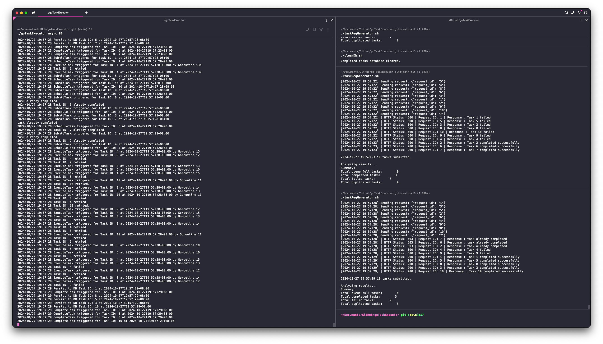
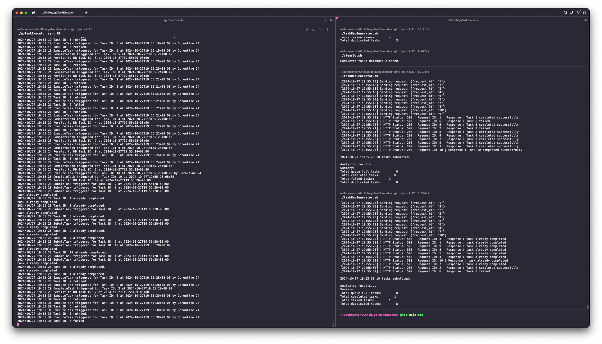

# Task Executor Service

This is a Go service that implements both synchronous (single-threaded) and asynchronous (multi-threaded) task execution. Tasks are submitted via HTTP POST requests and can be processed in either mode.

## Features

- Async mode: Uses goroutines for concurrent task processing

- Sync mode: Processes tasks sequentially in a single thread

- SQLite database for persisting completed tasks
- Configurable failure threshold and retry mechanism at most 3 times
- HTTP API endpoint for task submission, immediate log indicating task completed / failed / duplicated.

## Prerequisites

### Installing SQLite on Mac

`brew install sqlite`

## Usage

1. **Build the Program**

    Open a terminal in the project directory and run:

    ```bash
    go build
    ```

    This command compiles the Go service and generates the executable `goTaskExecutor`.

2. **Run the Task Executor**

    In the same terminal, start the Task Executor with the desired mode and failure percentage:

    ```bash
    ./goTaskExecutor <async/sync> <failurePercentage>
    ```

    - `<async/sync>`: Choose between asynchronous (`async`) or synchronous (`sync`) task processing.
    - `<failurePercentage>`: An integer between 0 and 100 representing the percentage chance of task failure to simulate unreliable environments.

    **Example:**

    ```bash
    ./goTaskExecutor async 20
    ```

    This command runs the Task Executor in asynchronous mode with a 20% failure rate.

3. **Generate Task Requests**

    Open another terminal in the project directory and execute the task request generator script:

    ```bash
    ./taskReqGenerator.sh
    ```

    This script sends HTTP POST requests to the Task Executor to submit tasks for processing.

4. **Monitoring and Logs**

    The Task Executor logs task processing details to the console. Monitor these logs to observe task execution, retries, and failures.
    The Task Request Generator logs the results of each request to `responses_<timestamp>.txt`.

5. **Database Access**

    Completed tasks are persisted in the SQLite database located at `./completedTasks.db`. You can inspect the database using any SQLite client:

    ```bash
    sqlite3 tasks.db
    ```

    **Example Query:**

    ```sql
    SELECT * FROM completedTasks;
    ```

## Running Unit Tests

```bash
./clearDb.sh
go test -v
```
